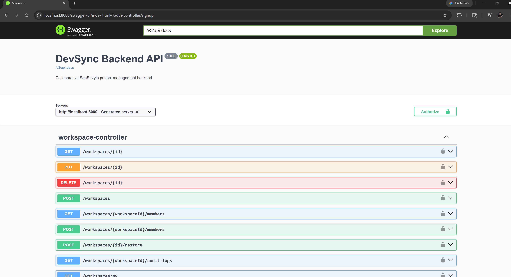
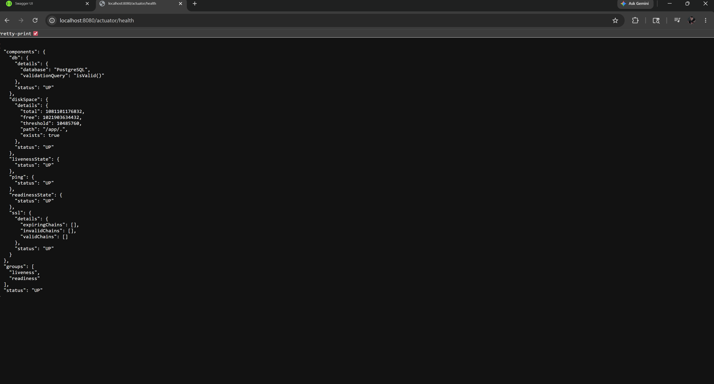
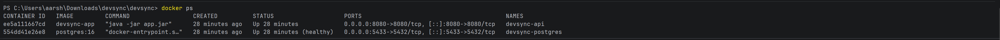
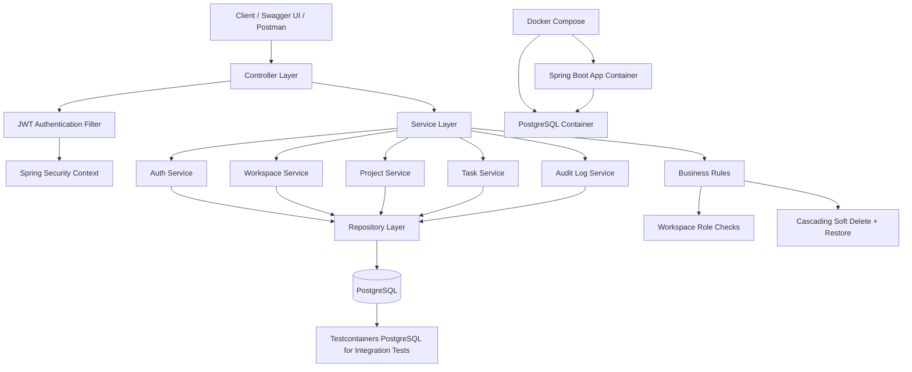

# DevSync Backend

DevSync is a collaborative project management backend built using Spring Boot and PostgreSQL.

It supports:
- JWT authentication
- workspace-based collaboration
- role-based authorization
- project/task management
- refresh tokens
- audit logging
- soft delete + restore
- Dockerized deployment
- integration and unit testing

---

# Tech Stack

- Java 21
- Spring Boot 4
- Spring Security + JWT
- PostgreSQL
- Spring Data JPA / Hibernate
- Maven
- Lombok
- Springdoc OpenAPI (Swagger)
- JUnit 5 + Mockito
- Testcontainers
- Docker + Docker Compose

---

# Features

## Authentication
- User signup/login
- BCrypt password hashing
- JWT access tokens
- Refresh token rotation
- Stateless authentication
- Logout support

## Workspace Management
- Create/update/delete workspaces
- Workspace membership system
- Role-based access:
    - OWNER
    - ADMIN
    - MEMBER

## Project Management
- Projects scoped inside workspaces
- Pagination and sorting
- Authorization checks

## Task Management
- CRUD operations
- Task assignment
- Status filtering
- Pagination support
- Assignee validation

## Audit Logging
Tracks:
- workspace events
- project events
- task events

Visible to:
- workspace owner
- admins

## Soft Delete Support
Implemented for:
- workspaces
- projects
- tasks

Supports:
- cascading soft delete
- restore endpoints
- parent-child validation during restore

## Testing

### Unit Tests
- Mockito + JUnit 5
- Service layer coverage
- Authorization edge cases

### Integration Tests
- SpringBootTest
- Testcontainers PostgreSQL
- Full auth flow testing
- Soft delete workflow testing

---

## Swagger UI Overview

## Actuator Health

## Docker Containers

# Architecture

DevSync follows a layered backend architecture with stateless JWT security, workspace-scoped authorization, audit logging, soft deletion, and PostgreSQL persistence.

## Layer Responsibilities

| Layer | Responsibility |
|---|---|
| Controller | Exposes REST APIs and handles request/response mapping |
| Security | Validates JWT tokens and sets authenticated user context |
| Service | Contains business logic, authorization checks, soft delete, restore, audit events |
| Repository | Handles database access using Spring Data JPA |
| Entity | Represents database models and relationships |
| DTO | Defines request/response payloads |
| Exception | Provides consistent API error responses |

## Key Architecture Decisions

- Stateless JWT authentication using Spring Security
- Refresh token rotation for secure session renewal
- Workspace-scoped RBAC with OWNER, ADMIN, and MEMBER roles
- Cascading soft delete for workspace, project, and task data
- Audit logging for important workspace/project/task events
- Dockerized app + PostgreSQL setup
- Integration testing with Testcontainers PostgreSQL